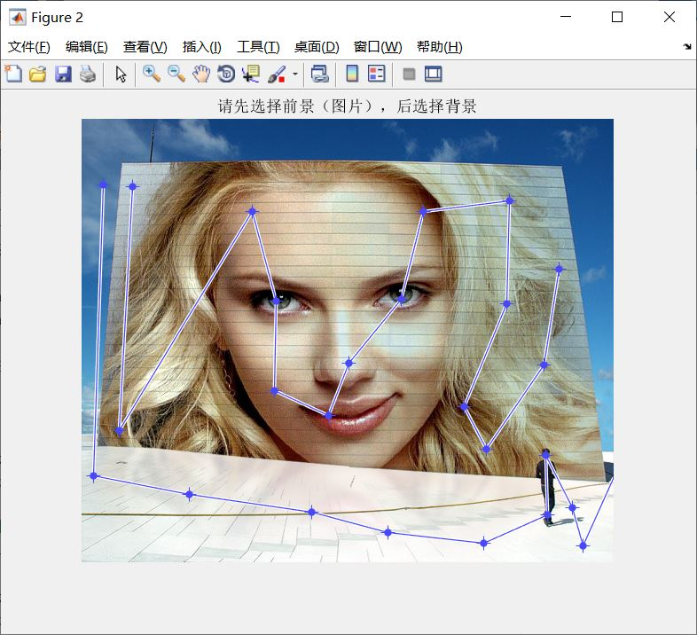
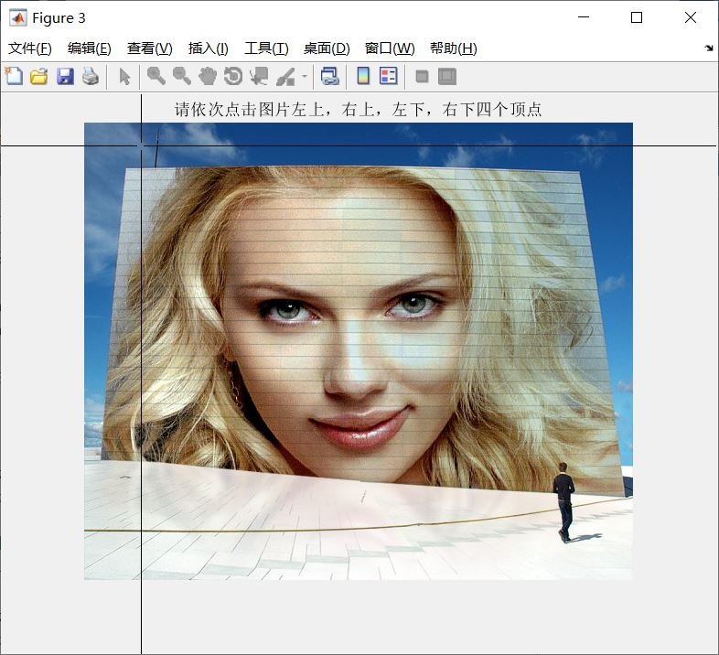
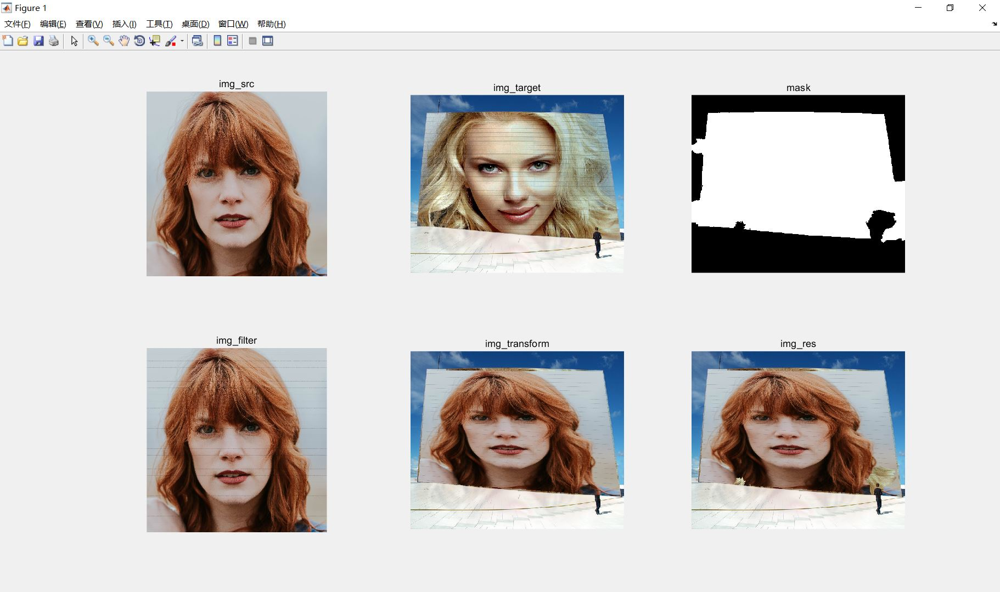
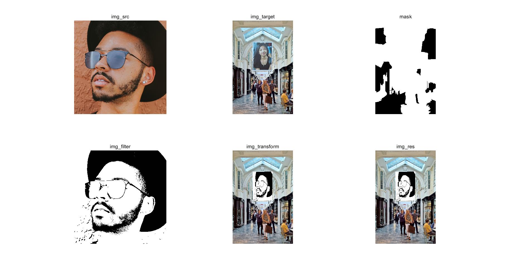
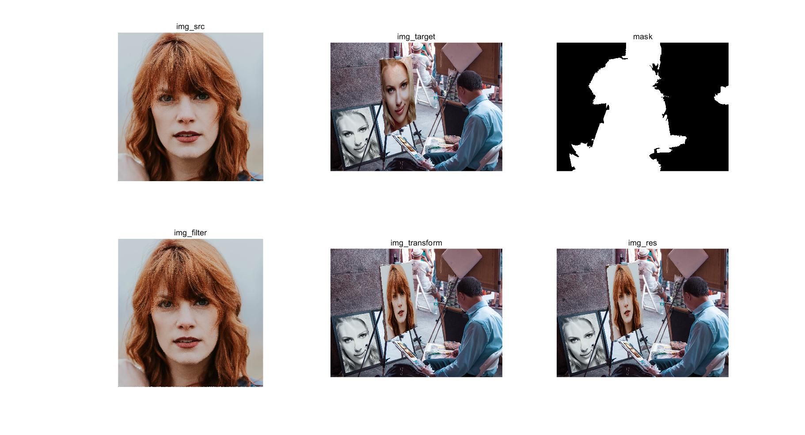
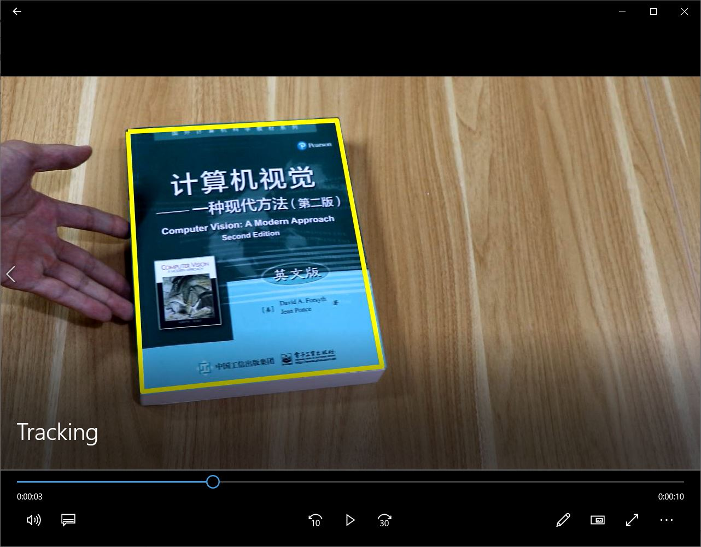
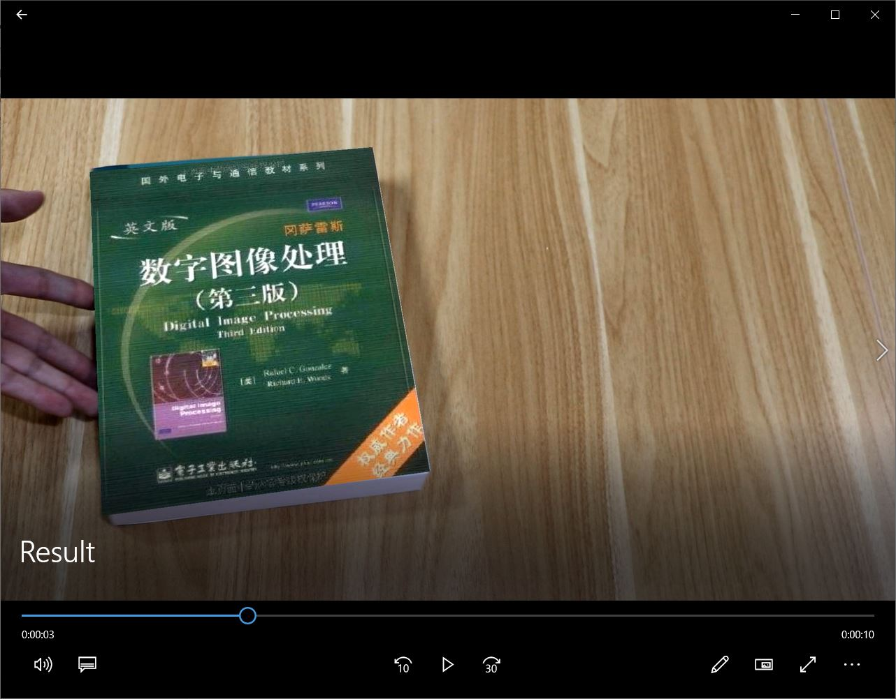

# 数字图像处理 综合作业4

## 任务1

### 算法思路

用户选择原图像和模板图像→读取原图像和模板图像→交互式前背景分割，得到mask→根据模板类型选择对应的滤镜，对原图进行风格变换→对风格变换后的图像结合模板图像进行形状变换→利用mask，结合模板图像与形状变换图像，得到最后的结果图

其中，前背景分割使用的是上一次综合作业的相关代码，提取超像素后使用懒人抠图。

共有6种滤镜可供选择：1对应油画风格，2对应墙体风格，3对应毛玻璃风格，4对应黑白风格，5对应素描风格，6对应怀旧风格，这些代码基本都来自网络。

形状变换使用的是matlab自带的fitgeotrans和imwarp函数，这部分参考了老师提供的相关代码。

### 运行方法

用户在main.m文件最上方输入原图像和模板图像的编号，代码注释中有详细说明→运行main.m文件→交互式标注前背景→点击照片的四个顶点，进行形状变换→得到最后结果

其中前背景标注后可能会需要几十秒的处理时间，请耐心等待。

### 实验结果

标注前背景：

标记图片角点：

最终结果：

其他结果：

## 任务2

### 算法思路

读取源图片与源视频→对视频中的每一帧，若到达特定的帧数，则用户标记四个角点，将源图像形状变换到该帧内，保存结果，更新参数。否则利用SURF算法将上一帧与该帧进行匹配，获得变换矩阵，通过变换矩阵获得该帧中角点的对应点，将源图像形状变换到该帧内，保存结果，更新参数→运行结束

其中形状变换使用的是任务1中的相关代码。

SURF算法使用了matlab自带的detectSURFFeatures、extractFeatures、matchFeatures等函数，参考了网上的代码。

由于没有结合霍夫变换等算法，故匹配结果会不断累计误差，故需要每隔一段时间进行一次手动校正，重新标记。

### 运行方法

运行main.m→标记四个角点→在100帧之后，每隔30帧标记一次角点，整个视频大概需要标记10次角点→运行结束

### 实验结果

## 参考文献

<https://blog.csdn.net/weixin_34090643/article/details/86040773>

<http://www.itkeyword.com/doc/6189573986904044x170/c-matlab-output>

<https://www.wenkuxiazai.com/doc/abcf3acb6edb6f1afe001fd3-5.html>

<https://blog.csdn.net/David_Han008/article/details/53176145>